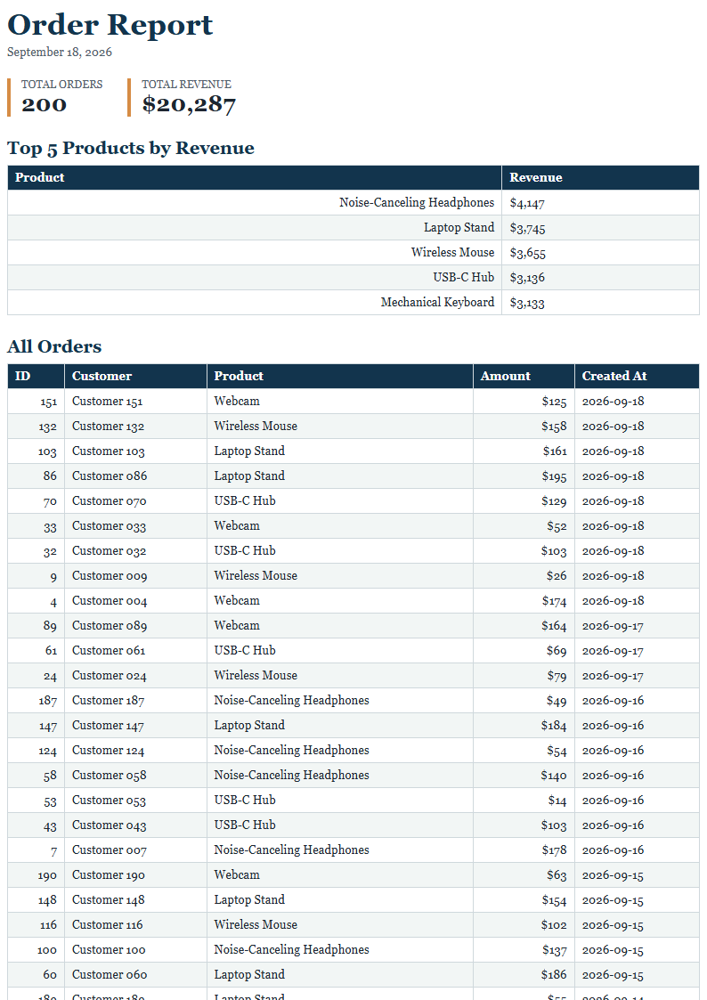

# PDF Report Generator

A FastAPI service that aggregates SQLite order data, renders a paginated HTML report with Playwright, stores the PDF locally, and serves it by ID.

## Dataset

The development dataset is 200 invented orders across six office-accessory products. Each row contains a customer name, product, integer amount from 5 to 200, and a date within the last 30 days.

## Run

Seed the SQLite database from the project root:

```powershell
.\venv\Scripts\python.exe .\seed.py
```

Start the API:

```powershell
cd .\venv
.\Scripts\python.exe -m uvicorn app.main:app --port 3000
```

## Aggregation SQL

```sql
-- Total number of orders
SELECT COUNT(*) AS total_orders
FROM orders;

-- Total revenue
SELECT SUM(amount) AS total_revenue
FROM orders;

-- Top five products by revenue
SELECT product, SUM(amount) AS revenue
FROM orders
GROUP BY product
ORDER BY revenue DESC
LIMIT 5;

-- Orders per day over the last seven calendar days, including today
SELECT created_at, COUNT(*) AS order_count
FROM orders
WHERE created_at >= date('now', '-6 days')
GROUP BY created_at
ORDER BY created_at;
```

## POST And Download Proof

`POST /reports` rendered and stored report `4bbc39c7-bb97-493d-bd91-abb39931303f` with `201 Created`. Download a generated report with:

```powershell
$reportId = "4bbc39c7-bb97-493d-bd91-abb39931303f"
curl.exe -o my-report.pdf "http://localhost:3000/reports/$reportId/file"
Start-Process .\my-report.pdf
```

Posting twice on the same UTC day returns the same report ID with `200 OK`; send `{"force":true}` to generate one new report with `201 Created`.

## Generated PDF



The metadata endpoint returns a few bytes of JSON, while `GET /reports/{id}/file` is the only endpoint that streams the PDF from disk. The request waits while Chromium renders the PDF; move rendering to a background job when it risks user-facing timeouts or requires reliable retries.

Daily idempotency prevents repeated requests from creating duplicate reports and wasting rendering resources. Without this check, a retry of an email-report request could send the same customer the same report twice.